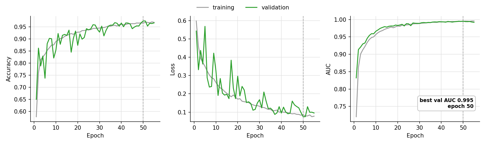
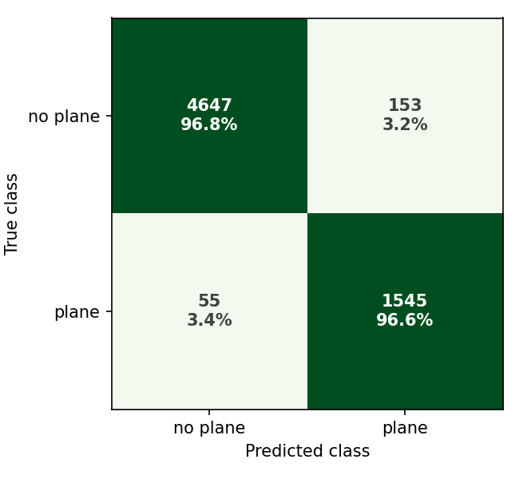
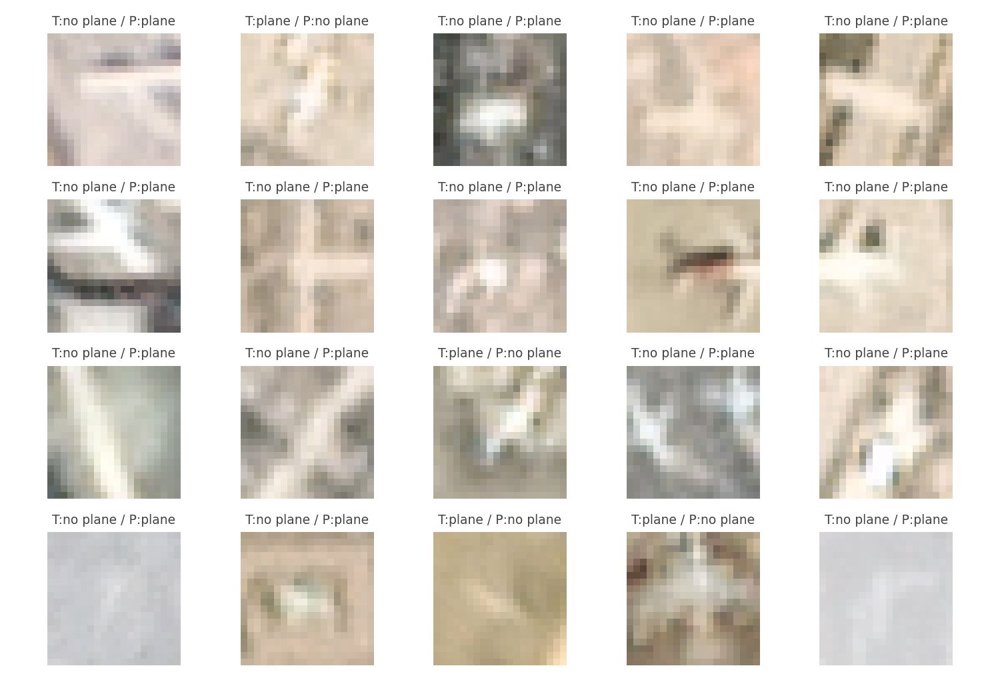

# CNN plane detection

A small convolutional network that answers one question about a 20x20 satellite
image chip: plane, or no plane.

The training data is [PlanesNet](https://www.kaggle.com/datasets/rhammell/planesnet),
32,000 RGB chips cut from PlanetScope scenes over California at 3 m per pixel.
Only 8,000 chips contain a plane. The other 24,000 were picked to hurt: a third
are ordinary landcover (water, vegetation, bare earth, buildings), a third show
part of a plane without the body, and a third are "confusers", bright or
elongated objects the dataset author collected because detection models had
mislabeled them before. Each filename starts with its label, so
`1__20140723_181317_0905__-122.14_37.69.png` is a plane and a `0__` prefix is
not.

## Setup

```
pip install -r requirements.txt
```

I tested with Python 3.9 and TensorFlow 2.15 on Windows 11. The dataset is on
[Kaggle](https://www.kaggle.com/datasets/rhammell/planesnet), or as a 25 MB
`planesnet.7z` in the author's [repo](https://github.com/rhammell/planesnet).
Extract it next to `train.py`. A flat `planesnet/` folder works, and so does
the nested `planesnet/planesnet/` layout that some unzip tools produce.

## Training

```
python train.py
```

The script loads the 32,000 chips and splits them 72/8/20 into train,
validation, and test sets, stratified and seeded. Balanced class weights keep
the minority plane class from being drowned out during training. Random flips
augment the chips. A plane viewed from overhead has no preferred orientation,
and the flips cost nothing. Training stops once validation AUC has gone 5
epochs without a new best, and the weights roll back to that best epoch. I
first stopped on validation loss instead; under class weights it jumped around
so much that the run ended at epoch 5 with a badly underfit model.

Flags: `--data-dir`, `--epochs` (ceiling, default 60), `--batch-size`,
`--out-dir`, and `--no-show` to save the figures without opening windows.

I kept the network small on purpose, 101k parameters:

```
RandomFlip -> Conv2D(32) -> Conv2D(64) -> MaxPooling2D
-> Conv2D(128) -> GlobalAveragePooling2D -> Dense(64) -> Dropout -> Dense(1)
```

The first version of this script had no pooling at all and flattened straight
into a Dense layer. That one matrix held 3.2 million parameters, 97% of the
model. The current network gets by with 1/30th of the weights.

## Results

One number means little on an imbalanced dataset. Always answering "no plane"
already scores 75%.

On the 6,400 held-out test chips the network reaches 96.7% accuracy, with a
recall of 0.97 and a precision of 0.91 on the plane class (AUC 0.994). Read
those two numbers together. The model finds nearly every plane and pays for it
with a false alarm on roughly one positive call in eleven. That is the trade
the balanced class weights ask for, and the right side for a detector to err
on. Drop the `class_weight` argument in `train.py` if you would rather have
fewer alarms and more missed planes.

Training took about half an hour on a laptop CPU. Early stopping ended the run
at epoch 55 of 60 and kept the weights from epoch 50, where
validation AUC peaked at 0.995.






Everything a run produces lands in `outputs/`: the trained model
(`plane_cnn.keras`), the test metrics and per-class report in `metrics.json`,
the per-epoch numbers in `history.json`, the training curves, a confusion
matrix, and grids of sample, correct, and misclassified chips. The
misclassified grid is worth a look. In my run most errors were false alarms on
bright plane-shaped blobs and white crosses on tarmac, the confusers doing
their job, and the few missed planes were faint, low-contrast ones.



## Predicting

```
python predict.py path/to/chip.png
python predict.py some_folder/
```

Loads `outputs/plane_cnn.keras` and prints a label and probability per file.

## Data license

The PlanesNet imagery comes from Planet's Open California program and is
distributed under CC-BY-SA 4.0. The chips are not included in this repo.
